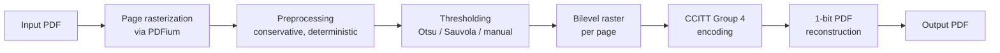

# Architecture

This document describes the intended architecture of Museion Binarize. It
reflects the design as of Milestone 0 (repository initialization); most of
the pipeline described below is **not implemented yet**. See
[`limitations.md`](limitations.md) for the current state.

## Goals driving the architecture

- **Determinism and reproducibility.** The same input file and parameters
  must always produce the same output, byte-for-byte where feasible. This
  rules out relying on nondeterministic libraries or unpinned dependency
  behavior in the processing path.
- **Local-first.** All processing happens on the user's machine. No scan,
  page image, or output file is transmitted anywhere.
- **Bounded memory.** Scanned scholarly books can run to hundreds of pages at
  high DPI. The core must process pages in a streaming, page-at-a-time (or
  otherwise memory-bounded) fashion rather than loading an entire book into
  memory at once.
- **Two front ends, one core.** A GUI (for most users) and a CLI (for
  scripting, batch jobs, and reproducible benchmarking) must produce
  identical output from identical input, because they share the same
  processing logic.

## Workspace layout

```
museion-binarize/
├── crates/
│   ├── museion-binarize-core/   # Pure Rust processing core
│   └── museion-binarize-cli/    # CLI front end, depends on core
└── apps/
    └── desktop/
        ├── src/                # React + TypeScript UI
        └── src-tauri/           # Tauri 2 Rust backend, depends on core
```

This is a standard Tauri 2 project layout (Tauri backend under
`apps/desktop/src-tauri`, frontend under `apps/desktop/src`), combined with a
Cargo workspace at the repository root so the core crate can be shared
between the CLI and the Tauri backend without duplication. No other
deviation from the structure requested for Milestone 0 was necessary.

## Core / CLI / desktop separation

- **`museion-binarize-core`** contains all image and PDF processing logic:
  decoding input, thresholding algorithms (Otsu, Sauvola, manual), bilevel
  image construction, CCITT Group 4 encoding, and PDF reconstruction. It
  depends only on general-purpose Rust crates (image processing, PDF
  writing, etc.) — **never** on Tauri, `wry`, or any GUI toolkit.
- **`museion-binarize-cli`** is a thin binary crate that parses command-line
  arguments (via `clap`) and calls into `museion-binarize-core`. It is the
  reference implementation for scripting and reproducible benchmarking.
- **`apps/desktop`** is a Tauri 2 application. Its Rust backend
  (`src-tauri`) depends on `museion-binarize-core` and exposes a small set
  of Tauri commands that the React/TypeScript frontend calls. The frontend
  contains no processing logic of its own.

### Why the core is independent of Tauri

1. **Testability.** Pure Rust logic in `museion-binarize-core` can be unit-
   and property-tested without spinning up a webview or windowing system,
   which matters for CI across three operating systems.
2. **Reuse.** The CLI and the desktop app must produce identical output.
   Sharing one crate is the only way to guarantee that without duplicating
   (and risking divergence in) the processing logic.
3. **Reproducible benchmarking.** The benchmarking framework (see
   [`benchmarking.md`](benchmarking.md)) is expected to run headlessly, most
   likely via the CLI or by depending on `museion-binarize-core` directly.
   A GUI dependency would make that impractical, especially in CI.
4. **Long-term flexibility.** Keeping the core UI-agnostic leaves room for
   other front ends (e.g. a future batch/server tool) without a rewrite.

## Intended PDF pipeline (planned, not yet implemented)



Stages, at a high level:

1. **Rasterization.** Input PDF pages are rendered to raster images using
   PDFium (see below). This is the only step that depends on an external
   PDF rendering engine.
2. **Preprocessing.** Conservative, deterministic operations (e.g. noise
   reduction) applied before thresholding. See
   [`algorithms.md`](algorithms.md) for the risks of over-aggressive
   preprocessing, particularly for small typographic detail.
3. **Thresholding.** Otsu, Sauvola, or a manual threshold converts each
   grayscale page into a true bilevel (1-bit) raster.
4. **CCITT Group 4 encoding.** The bilevel raster is compressed using the
   CCITT Group 4 algorithm, the standard for compact bilevel scanned-document
   PDFs.
5. **PDF reconstruction.** A new PDF is built directly from the CCITT
   Group 4-encoded bilevel images — not merely re-saved from the rendering
   engine — so that the output is a genuine 1-bit PDF rather than a
   downsampled color/grayscale one.

### Planned PDFium boundary

PDFium is used strictly as a **rasterization** engine: turning existing PDF
pages into pixels the core can threshold. It is treated as an isolated
dependency behind a narrow internal interface in `museion-binarize-core`, so
that:

- PDFium binaries can be fetched/built through a separate, documented,
  controlled process per platform (macOS, Windows, Linux) rather than
  committed to this repository (see [`.gitignore`](../.gitignore)).
- The rest of the core — thresholding, encoding, PDF writing — has no direct
  dependency on PDFium's API and could, in principle, be tested or reused
  with a different rasterization backend.
- FFI/`unsafe` surface area is confined to one module, which matters for the
  security review process (see [`SECURITY.md`](../SECURITY.md)).

### Planned 1-bit CCITT Group 4 output

The output PDF's image streams are true 1-bit-per-pixel images compressed
with CCITT Group 4 (`/Filter /CCITTFaxDecode`), the same approach used by
long-established scanning and archival tools. This is what makes the output
"clean and compact": no anti-aliased grayscale, no lossy DCT artifacts, and
file sizes far smaller than color or grayscale scans.

### Bounded-memory design

The core is designed to process one page (or a small, fixed-size window of
pages) at a time: rasterize, threshold, encode, write, release, move to the
next page. This keeps *per-page* memory bounded, which matters for
benchmarking (see [`benchmarking.md`](benchmarking.md)) and for usability
on modest hardware.

This is no longer the whole story as of Milestone 3: the persistent
document session (see [`pdf-pipeline-session.md`](pdf-pipeline-session.md))
holds the *entire source file's bytes* in memory for the duration of an
operation, so total memory is not O(1) in source size either. Read
[`pdf-pipeline-session.md`](pdf-pipeline-session.md) for the honest, current
bound rather than treating this section as up to date on its own.

## Cross-platform packaging

Tauri 2 is used specifically because it produces small, native-webview-based
application bundles for macOS, Windows, and Linux from one codebase, and
because its Rust backend integrates directly with `museion-binarize-core`
without an additional FFI layer. Platform-specific packaging (DMG, MSI,
AppImage/deb/rpm) is intentionally out of scope for Milestone 0 CI, which
focuses on build and test correctness; packaging workflows will be added in
a later milestone (see [`roadmap.md`](roadmap.md)).

## Trust and reproducibility principles

- **No network calls in the processing path.** Rasterization, thresholding,
  encoding, and PDF writing operate entirely on local files.
- **No hidden nondeterminism.** Given the same input file, algorithm choice,
  and parameters, output must be reproducible. Where third-party libraries
  introduce nondeterminism (e.g. parallel iteration order affecting
  floating-point summation), it must be documented and, where it affects
  output bytes, avoided.
- **Deterministic algorithms only, for now.** Phase 1 intentionally limits
  itself to classical, explainable thresholding methods so that every pixel
  decision in the output can be attributed to a documented algorithm and
  parameter set, rather than to an opaque model. See
  [`algorithms.md`](algorithms.md).
- **No claims without benchmarks.** Any statement about output quality,
  performance, or typographic preservation must be backed by the
  reproducible benchmarking framework described in
  [`benchmarking.md`](benchmarking.md), not by inspection of a handful of
  examples.


## The end-to-end PDF pipeline (Milestone 2, corrected by Milestone 3)

```
input.pdf
  │
  ├─ document_session.rs  opens the document ONCE (a real, single open —
  │                        see below) via the PDFium boundary
  │                        (pdfium_backend.rs), then rasterizes page N at
  │                        the requested DPI onto opaque white, in visible
  │                        orientation, from that same open session
  ▼
  ├─ image_pipeline.rs .. the single orchestrator: grayscale → contrast →
  │                        preprocessing → binarization → cleanup → pack,
  │                        also producing the measurements `analyze` and
  │                        `process` reports are built from
  ▼
  ├─ ccitt.rs ........... CCITT Group 4 encoding of the packed bilevel page
  ▼
  ├─ pdf_writer.rs ...... appends a 1-bit /CCITTFaxDecode image XObject,
  │                        content stream, and page object      [process]
  ▼
  ├─ pipeline.rs ........ drives the loop, drops page-N buffers before
  │                        page N+1, checks cancellation between stages,
  │                        writes to a temporary file            [process]
  ▼
  ├─ validation.rs ...... reopens the temporary file as its own, separate
  │                        document session, checks page count,
  │                        dimensions, and that pages render     [process]
  ▼
output.pdf (atomically renamed into place only after validation passes)
```

`analyze` follows the same rasterization and image-processing path but
stops after `image_pipeline.rs`: it never invokes `ccitt.rs`, `pdf_writer.rs`,
or `validation.rs` (CCITT encoding runs only if `--encode` is passed, and
even then only to measure its output size — nothing is written).

### A Milestone 2 claim this document previously got wrong

Earlier revisions of this document (and Milestone 2's own module doc
comments) claimed `renderer.rs` opened the document "ONCE." That was
false: `PdfRenderer::render_page` actually reopened and reparsed the
source file from disk on **every call**, once per page, because
`PdfDocument` was believed to require a self-referential struct to persist
across calls. Milestone 3 found that belief was wrong (see
[`pdf-pipeline-session.md`](pdf-pipeline-session.md)) and replaced
`renderer.rs` with `document_session.rs`'s `PdfDocumentSession`, which
really does open the source exactly once per operation. This correction —
not a new claim — is what makes the diagram above accurate.

### Module responsibilities

| Module | Responsibility |
|---|---|
| `page_geometry.rs` | Points↔pixels, rotation semantics, safety limits. Pure arithmetic, no PDFium. |
| `document.rs` | Museion-owned document/page/metadata types. |
| `source_identity.rs` | What was actually opened: canonical path, byte length, modification time, opt-in content hash. |
| `pdfium_backend.rs` | Library resolution and the process-wide PDFium session. |
| `document_session.rs` | The persistent, single-open-per-operation document session; the `DocumentSession` trait the rest of the pipeline depends on instead of PDFium types directly. |
| `image_pipeline.rs` | The one place that defines image-processing stage order and produces per-page measurements. |
| `pdf_writer.rs` | Deterministic bilevel PDF construction; also measures the writer's own fixed per-page/per-document container overhead for the size estimator. |
| `pipeline.rs` | `process_pdf`/`analyze_pdf`/`estimate_output_size` orchestration, progress, cancellation, temp files, atomic persist. |
| `estimation.rs` | Sampled output-size estimation: deterministic sample selection, quartiles, the `SizeEstimateReport` type, settings fingerprinting, estimate/actual comparison. Pure arithmetic, no PDFium. |
| `validation.rs` | Reopen-and-render verification, separate from construction. |
| `timing.rs` | Shared stage-duration measurement, used identically by `process` and `analyze`. |
| `analysis.rs` | Document/page analysis report types and aggregation (min/max/mean/median). |
| `report.rs` | The versioned `ReportEnvelope`/`ErrorEnvelope` shared by every JSON report; path-rendering modes. |
| `page_selection.rs` | Parses and validates `--pages` syntax into zero-based indices. |

PDFium types never escape `pdfium_backend.rs` and `document_session.rs`.
The core remains free of Tauri, and the CLI and (future) desktop app share
exactly one implementation. See [`pdf-pipeline-session.md`](pdf-pipeline-session.md)
for the session's lifetime-safety argument and memory model, and
[`cli.md`](cli.md)/[`reporting.md`](reporting.md) for the CLI and report
surface built on top of it in Milestone 3.

### Deviations from the originally documented layout

`test_fixtures.rs` lives in the library rather than under `tests/`, so that
integration tests and the `gen_fixtures` example share one definition of
each synthetic fixture. PDFium provisioning lives in `third_party/pdfium/`
(manifest and licenses) with the binary itself in the gitignored
`target/pdfium/<triple>/`.
