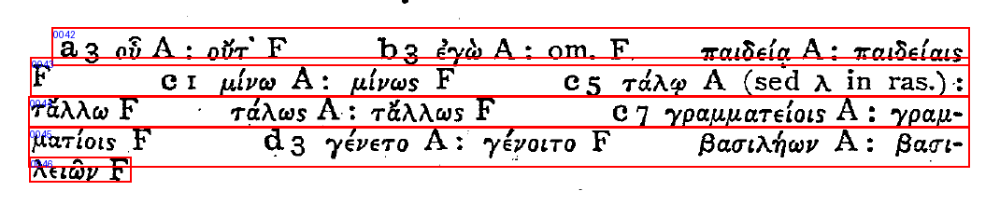
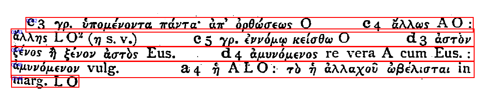

# Surya-only bounded apparatus adapter repair

状态：`SURYA_APPARATUS_ADAPTER_REPAIR_COMPLETE`。意图 `aligned`，依据 `intent.md` §8.5；本地适配器开发验收完成。没有修改Paddle、评分阈值、参考标注、R2证据包或16页holdout。

## 修复与专项验收

只对Surya使用页内相对行高筛选异常高且宽的框，再以平滑墨迹投影中重复强峰及其间低谷确定纵向切分。要求峰间距与页内行高相容、低谷显著；证据不足则保留原框。禁止大小相差超过两倍高度的框相互吸附。规则不读取参考标注、文本、页码、行ID或语义角色。

- Burnet 1100：d0032在y=1720、1753、1786处分成四个子框；0042–0045分别对应独立logical line。d0034仅与第三条子行d0032-y2组合，不再进入跨行大框。
- Burnet 1400：d0033在y=1751、1783处分成三条；0043–0045独立匹配。
- 两个目标页各5/5 apparatus匹配；残余碎片化0、跨行污染0。已查看原图叠框，确认行级分割；保留原框padding，边界并非逐字形精确轮廓。
- 全部27条apparatus无新增over-split诊断。原有Burnet0300 candidate-0033残余碎片化仍为1条，本轮未扩展修复它。
- 原始detector payload、box、polygon、confidence完整保留；新子框以source_fragment_id/source_pointer追溯，保留源polygon/features、cut_ys、row_index、valley evidence和输出fragment IDs。子框bbox完整无损分区原框，polygon按y裁剪。原有region、column、margin lane、derivation和低层D-ready字段保留。

## 两遍完整25页regression

采用R2两次独立真实Surya检测留下的完整raw输出，执行25页×2次adapter replay。两遍是不同检测pass的重放，并非复制第一遍。没有新增模型推理；结论仅覆盖adapter路径。实施代码哈希和每个raw文件SHA见results.json。

| 指标 | 修复前 | 修复后 |
|---|---:|---:|
| apparatus匹配 | 21/27 | 27/27 |
| apparatus support union coverage | 68.2819% | 87.5867% |
| 行框micro-F1，IoU≥0.30 | 96.9455% | 97.2757% |
| 严格F1，IoU≥0.50 | 94.1818% | 94.5877% |
| 全局逆序对 | 27 | 27 |
| TOC匹配 | 36/36 | 36/36 |
| marginalia匹配 | 25/35 | 25/35 |

两遍各23/23非目标页的fragments与logical_lines完全一致；两目标页所有非apparatus参考行的匹配状态和已匹配logical line亦完全一致。两遍50份文件全部通过schema、原始信息保留、子框面积/范围守恒验证；25/25页geometry digest跨遍一致，所有指标一致。双栏结构、栏内及跨栏顺序未退化，跨栏逆序仍为0；TOC/marginalia专项完整记录逐页相同。

测试：`python -m pytest -q scripts/ocr/geometry/test_finalist_adapters.py scripts/ocr/geometry/test_finalist_metrics.py scripts/ocr/geometry/test_dev_geometry_bakeoff.py` → 14 passed。新增测试覆盖三行拆分、小框归属、不可拆大框防吸附、原始/子框溯源与Paddle路径隔离。

运行器：`scripts/ocr/geometry/run_surya_adapter_repair.py`，已完成输出受防覆盖保护。`adapter.diff`为相对R2.2的准确补丁，before/after快照可供独立复核。

边界：这是已知开发页上的有限修复，泛化到其他字号、倾斜或版式仍未验证；未宣告语义D、独立holdout、文字转写、provider冻结或生产通过。

## 目标页叠框

