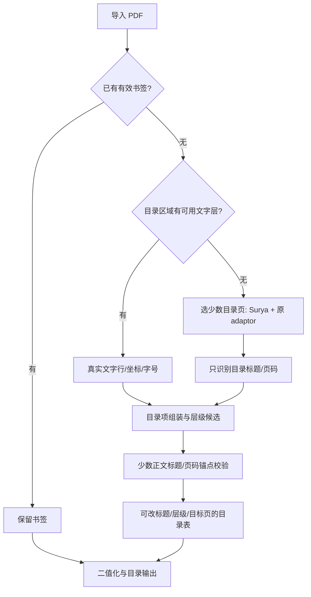

# 免费本地书签阶段：成熟度、最小流程与下一步

日期：2026-09-10。意图基线：`intent.md` §8.32，LB1–LB4。

**结论：值得推进，但目前是“已有二值化产品骨架＋可复用目录编译器＋新文字层开发入口”，还不是可分发的自动目录产品。** 当前短板主要是书签专用输入、目录语义整理、局部取证调度和编辑交付，不是需要重新做 Surya/Museion adaptor。结构90%与文字80%的收益目标尚未验证；不能把 geometry/OCR 旧成绩当成目录成绩。

## 1. 现有工程到底具备什么

| 环节 | 代码实况 | 对本阶段的判断 |
|---|---|---|
| 本地二值化 | Rust/PDFium、1-bit 输出、桌面与CLI、分发脚本已存在 | 可复用。此次未重新验收二值化，也未把旧构建当新版本验收 |
| Surya＋adaptor | 原始框、片段→logical line、列/band、reading order、边码、行高、缩进/同行证据、spatial supports和来源可追溯 | 对“目录行归组、正文标题候选和页码关联”已有足够基础，可保持架构 |
| 语义层级 | adaptor明确标记 `low_level_geometric_hints_only`；旧验证甚至禁止 `heading_level/role/parent/toc_membership` | **预埋的是推断依据，不是已经识别好的H1/H2/H3** |
| 目录编译 | 前置目录检测、尾页码、跨行标题、两栏、罗马/阿拉伯页码、分段offset、单调目标、编号/缩进层级、确认门 | 逻辑完整，但真实文字流适配弱，不能直接宣布90% |
| 输入装配 | `assembly.rs`要求每页记录；旧 `ocr.rs` 虽能走 native text，却处于整书OCR路由；native框是近似坐标 | 不适合稀疏识别。要建立独立书签取证输入，不能把没扫描的页伪装成“完整OCR” |
| 人工编辑 | 已有 confirm/reject、改标题、reparent | 当前 `ReviewAction` 没有目标页修改动作；还需把目标页、层级、标题在同一轻量表格里改完并导出 |
| PDF交付 | 既有构造器与双重重开检查可复用 | 现有文字忠实度校验会拒绝部分原生字体；书签仅改outline的消费边界尚不独立 |
| 打包分发 | Tauri、PDFium打包、DMG、签名、SBOM、release-readiness脚本已有 | 新免费书签路径尚未接桌面/打包，base发布检查仍有8项缺证据 |

依据：`crates/mpdf-core/src/bookmarks/`、`scripts/ocr/geometry/{finalist_adapters,shared_geometry_adapter,spatial_supports}.py`、`scripts/distribution/`。README中的旧Tesseract/产品状态描述不是本阶段的新意图。

## 2. 已实现的最小文字层入口

新增独立开发命令 `crates/mpdf-core/examples/native_bookmarks.rs`，文字层输入实现在 `examples/native_bookmarks/intake.rs`。为保持所有冻结核心文件逐字不变，本轮没有向原core模块添加导出；后续产品集成再以明确版本接入共享入口。

路径：实际PDF → PDFium读取已有outline或文字层 → native-only兼容记录 → 原目录编译器 → 原PDF构造/校验 → 新PDF与可审查MDP。没有模型调用、没有二次添加文字层、没有修改源PDF。没有文字或不可用文字的页单独报告；U+FFFE等提取警告保留原文，不猜测替换。native记录覆盖的是“已检查文字层”的页面，不是“已识别扫描图像”的页面。

```sh
# 在仓库根目录执行；PDFium必须已在本机，程序不下载它。
CARGO_INCREMENTAL=0 cargo build -p mpdf-core --example native_bookmarks --offline
MPDF_PDFIUM_LIBRARY="$(pwd)/target/pdfium/aarch64-apple-darwin/libpdfium.dylib" \
  target/debug/examples/native_bookmarks /absolute/input.pdf /absolute/new-output-directory
```

输出目录必须不存在。产物为 `summary.json`、`book.mdp/`，仅在确认且写回校验通过时有 `bookmarked.pdf`。如果校验阻止输出，保留候选与错误摘要并返回失败。该命令只建立书签，不执行二值化，也未接入桌面按钮；两功能的最终组合仍是下一步工作。

### 实际验证结果与缺陷

| 用例 | 结果 | 证明范围 |
|---|---|---|
| 7页真实生成PDF：六条明确编号目录、无Contents标签 | 6/6自动书签，标题/父子层级/目标页全部正确；一次约0.29秒 | 已跑通真实文字提取→实际PDF；不是注入OCR fixture |
| 同布局增加Contents标签 | 5条自动、1条skipped；`Contents 1. Origins`被错误合并 | 明确失败反例；无标签版本是定位问题的对照，不能拿其6/6代表普通书 |
| 额外空白页、仅图形PDF自带outline、无文字无outline、已有输出目录 | 5项Python消费者测试合计全部通过 | 覆盖空页报告、outline优先、无证据拒绝、源文件/人工文件不覆盖 |
| Horn《Lambda New Essays》325页，副本移除旧outline后推断 | 20个候选，2自动、1待审、17跳过；随后原生字体校验阻止PDF输出 | 两个自动目标与旧outline对照吻合：Index locorum→308、Index rerum→322；不是20条正确率，更不是完整目录覆盖 |
| Menn《Plato on God as Nous》202页，同样移除outline | 10候选，0自动、3待审、7跳过；约9.73秒，未输出PDF | 页码单独成行、跨行、印刷页码映射等仍需输入/语义升级 |

两本真实书只从既有本地归档读取，原文件不变；移除outline的副本放在本次证据目录。旧outline只作事后粗对照，不作为推断输入，也不是独立人类Gold。

现有书签单元测试41通过，新增入口单元测试2通过，编译器集成26通过。既有PDF集成3项中2通过、1失败：源文件被测试故意破坏后，当前校验器提前返回PDFium FormatError，而旧断言期待 `source PDF changed`。诊断副本复现了错误，未改原测试或校验器；不能写成“全部回归通过”。

三个定位到的升级点：

1. `toc_parse.rs` 的近似几何分支按相邻ordinal合并；Contents关键词过滤发生在合并之后，所以第一条会污染。该问题在此次原生路径被直接复现，历史起源未追溯。
2. `.text().all()`保留的抽取顺序不等于视觉行；标题、leader、页码可分成不同文本行；作者行也可能被并入标题。必须引入真实native行位置/字体特征和书签语义整理。
3. `searchable_output.rs` 对源文档也调用当前literal字体解码器。真实书触发 `transcription_fidelity:PDF_LITERAL:unsupported_native_font`。本轮保留该拒绝，没有绕过它；下一步应设计并审核只改outline时的原始页面对象/资源/文字/渲染不变验证。

## 3. Surya局部recognition的实际代价

预先固定12张现有开发图：8个目录supports（含独立页码）、1个标题/页眉、1个页码、2个Greek正文对照。没有修改原裁图、模型或几何。CPU、4线程、batch=1、仅缓存权重；每项30秒、worker300秒上限，无云调用/付费/下载。

| 引擎 | 加载/初始化 | 12图识别合计 | worker总耗时 | 观察 |
|---|---:|---:|---:|---|
| Surya 0.17兼容环境，recognition checkpoint 2025_09_23 | 8.26s | 33.41s | 42.33s | 12/12有结果，当前法/德目录字母重音保留较好；Greek对照仍有错字 |
| Paddle `el_PP-OCRv5_mobile_rec` | 23.31s | 2.33s | 26.29s | 12/12有结果；法德重音漏失，如 `démiurge→demiurge`、`über→ber` |
| Apple Vision `.fast` | 未单独分离 | 0.45s（含请求内部初始化） | 未与worker总耗时同口径比较 | 11/12非空；30空、35→3、1.1.1→l.l.l，Greek失败 |
| Apple Vision `.accurate` | 首项约63.20s后失败 | 不可作为有效速度 | 12/12错误 | 本机E5RT compute operation错误；不推广为所有Mac不可用 |

这里比较的是**相同小图的识别**，没有目录发现、PDF渲染、Surya检测/adaptor、目标页验证、编辑和写回的总时间。Paddle是希腊文mobile模型，不能把它的质量代表所有Paddle/RapidOCR模型。两者初始化可能受缓存/系统负载影响，不是多机或多轮性能统计。

Surya的真实增量并非“几乎免费”，但数量控制在几十行时已与全书OCR不同。数字裁图约0.45秒、长标题/正文约3–6秒，不能按每页常数估时。应一次任务加载一次模型、只提交所需行，后续再测batch效果。当前未做batch1/4比较、MPS/GPU、整页Paddle end-to-end或全书稀疏流程，不据此声称整书提速多少倍。

本机recognition权重目录约1.3GB；Paddle el mobile约7.6MB，均不含PyTorch/Paddle/Python runtime。少识别页面会减少推理时间，**不会自动缩小Surya安装体积或消除冷启动**。

初次按页号选取的v1样本经源图核对发现是正文而非目录，在推理前弃用；保留v1说明，不混入结果。v2的10/11号明确标记为正文对照，不当成标题样本。见 `recognition-inputs-v2.json` 与 `recognition-contact-v2.png`。

## 4. Apple、Surya layout与RapidOCR的取舍

苹果不需要自动操作“预览”窗口。公开的 [Vision VNRecognizeTextRequest](https://developer.apple.com/documentation/vision/vnrecognizetextrequest) 就能识别图像并返回框；[fast/accurate](https://developer.apple.com/documentation/vision/vnrequesttextrecognitionlevel) 是正式API。本轮约50行Swift探针已编译执行，说明基础接入便捷。沙箱内先发生CVPixelBuffer错误，经一次沙箱外运行fast成功、accurate仍失败。不能把开发探针当作签名App中的稳定性验证。

建议：主线仍先按文字层＋Surya设计；Mac的Vision fast作为待评估可选加速项，不成为跨平台前置依赖。它对单个页码的错误尤其说明，速度极快也需要目标页锚点和人工纠正。fast本机返回6种西欧语言，accurate返回更广语言列表，但未包含Greek。

[Surya 0.17文档](https://raw.githubusercontent.com/datalab-to/surya/v0.17.0/README.md)的独立layout模型提供 `Section-header`、`Table-of-contents`、`Page-header/footer` 等类别与reading order；它没有直接给出书内H1/H2/H3树。当前adaptor仅使用detector与几何，不因已有Surya就自动获得这些类别。可以将layout结果作为可选、独立、版本化的旁路提示，但要单测其时间和收益；本轮没有加载layout模型，也不修改冻结adaptor。

[RapidOCR](https://github.com/RapidAI/RapidOCR)支持ONNX等运行后端，值得作为轻量检测＋识别候选。当前环境未安装RapidOCR，未下载模型，因此没有实测其end-to-end速度；本次Paddle recognition不能冒充RapidOCR端到端对照。下一轮如比较，应使用相同目录页，分别记录全流程冷/热耗时、真实目录项恢复、目标页正确率、重音/中文/Greek标题质量与安装包体积。

免费使用和可任意再分发要分开核对。当前冻结的 [Surya v0.17](https://raw.githubusercontent.com/datalab-to/surya/v0.17.0/README.md)说明代码GPL，权重采用带商业条件的修改版OpenRAIL-M，免费范围包括研究/个人和低于2M美元融资/收入的startup。[新版Surya主页](https://github.com/datalab-to/surya)的代码许可、模型和运行方式已经不同，不能拿新版声明替旧冻结版本。用户零API费可以实现；正式分发前仍需按实际版本整理代码和权重许可，不能把“免费本地”宣传成无条件开放权重。

## 5. 建议的架构升级顺序

保持Surya＋Museion adaptor原封不动；新增书签专用消费层，而非继续推进全文OCR。



1. **先做好native文本输入和目录语义。** 获取真实glyph/line坐标和字号，不再用均匀分布的假行框；保留原始抽取与单独的bookmarks文本投影。识别Contents标签、作者行、跨行标题和页码列。针对已复现问题准备新版本解析规则，保留冻结0.4回归/历史结果；本轮只提出此升级，未改冻结解析器。
2. **新增稀疏书签证据合同。** 明确 `native_extracted / locally_recognized / uninspected / failed`，附来源页、ROI和变换；正文只验证少量锚点。现有“每页完整OCR”合同继续服务未来OCR，不能降低其完整性要求或补空冒充全书识别。
3. **先目录，再少量锚点。** 建议开发默认先看前8页，必要时扩展前置窗口；允许用户直接指定目录页。按明确编号、TOC缩进、字高、leader与右端数字建树；正文用3–5个分散标题/印刷页码估offset，异常局部再扩展。页码重启、罗马前言、插页必须允许分段映射；预算耗尽就交给用户，而非转成全书OCR。上述数字是建议的实验预算，尚非产品承诺。
4. **recognizer可替换但geometry不变。** Surya保留作为首个可用跨平台候选；Paddle/RapidOCR按实际语言与冷启动选择。Mac Vision可选。优先研究“整页轻量识别用于目录表”能否省掉部分TOC geometry步骤；只有对照证据足够才建议切换，不能直接更换原adaptor。
5. **把人工纠正和导出做完整。** 至少能改标题、父子层级、目标页、删/加条目；点击跳转源页；保存后新PDF重开核对。单独设计bookmark-only源对象保全校验，处理上述原生字体兼容问题；二值化重建PDF时明确是否保留原文字层，不能让“加目录”隐含新增全文OCR。
6. **最后接桌面并打包。** 主入口应可在无API key/网络/云服务时完成基本任务。清理当前阶段UI中误导的OCR前置依赖；按实际部署语言模型准备离线包或明确可选包。完成干净机器安装、冷启动、取消、模型缺失提示、复核编辑、导出重开后再分发。

这些升级可以围绕原架构做加法，不需要重新做高质量OCR。但其中冻结解析器/校验边界的版本化演进需要具体设计审查；本次未把现有失败静默改成通过。

## 6. 目录自己的验收口径与封装准备

建议为该产品重新建立非sealed的目录开发集，覆盖至少：单栏/双栏、作者＋标题、跨行、罗马/阿拉伯切换、印刷页与物理页偏移、已有旧OCR文字层、中文/西欧重音/Greek标题、无印刷目录。不要借用已经封存的OCR holdout。

- 结构：以源书完整目录项为分母，分别报告条目召回、父关系/层级正确、实际目标页正确；另给三项同时成立的比例。缺失/拒绝不从分母删除。
- 文字：至少同时给标题整条正确率与字符准确率，保留重音；80%必须明确指哪一种。leader排除可以单列投影口径，但不能消除有意义的标点/编号。
- 页码：即使允许标题文字80%，也不能把错目标页隐藏在总体字符准确率里。
- 人工成本：每本需修改条数、操作次数和实测分钟数；不能用大量待审达到表面高准确率。
- 性能：整书导入至可复核目录的冷/热P50/P95，识别页数/行数、峰值内存、包体积。以上是建议，未获得本轮总体测量。

本次静态base发布检查尚缺：跨平台运行、Developer ID/notary、分发CI、macOS安装运行、PDFium smoke收据、隐私/可访问性/性能证据、阅读器矩阵、升级安装。云端付费/账户/支付门不应成为此次免费本地产品的工作目标。此次未签名、发布、购买或启动后台任务。

**意图对齐：`aligned`，基线§8.32 LB1–LB4。** 已交付调研、受限native最小流程、识别时延实验、具体缺陷及升级建议；OCR、Surya/adaptor和冻结规则未改。**产品质量与分发就绪：`unverified / not ready`。** 两本真实无outline副本结果不足，扫描书自动目录链路、结构90%/文字80%、目标页编辑与桌面组合交付尚未完成。

证据总目录：[`evidence/local-bookmarks-2026-09-10/`](evidence/local-bookmarks-2026-09-10/)。运行/验证说明见 [`../scripts/bookmarks/README-native.md`](../scripts/bookmarks/README-native.md)。
